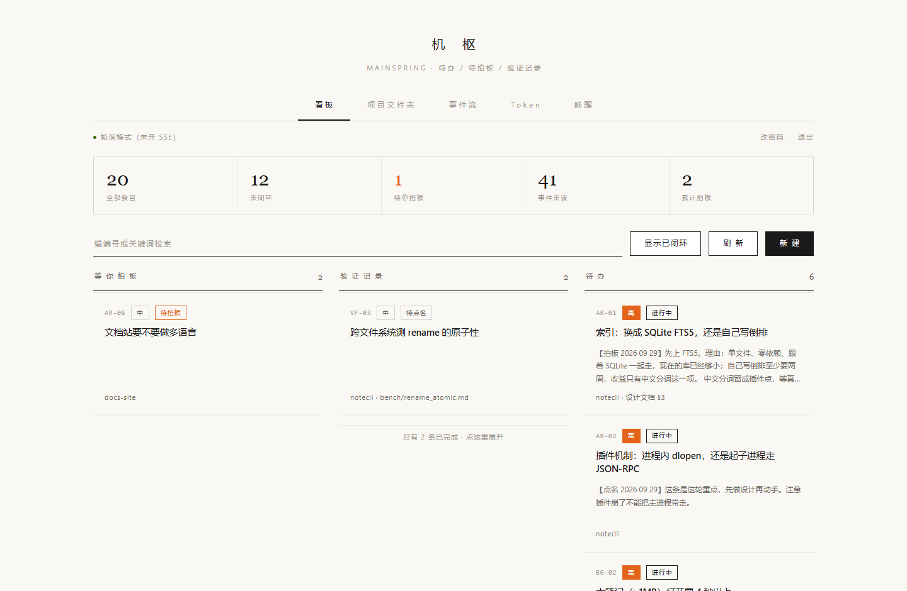
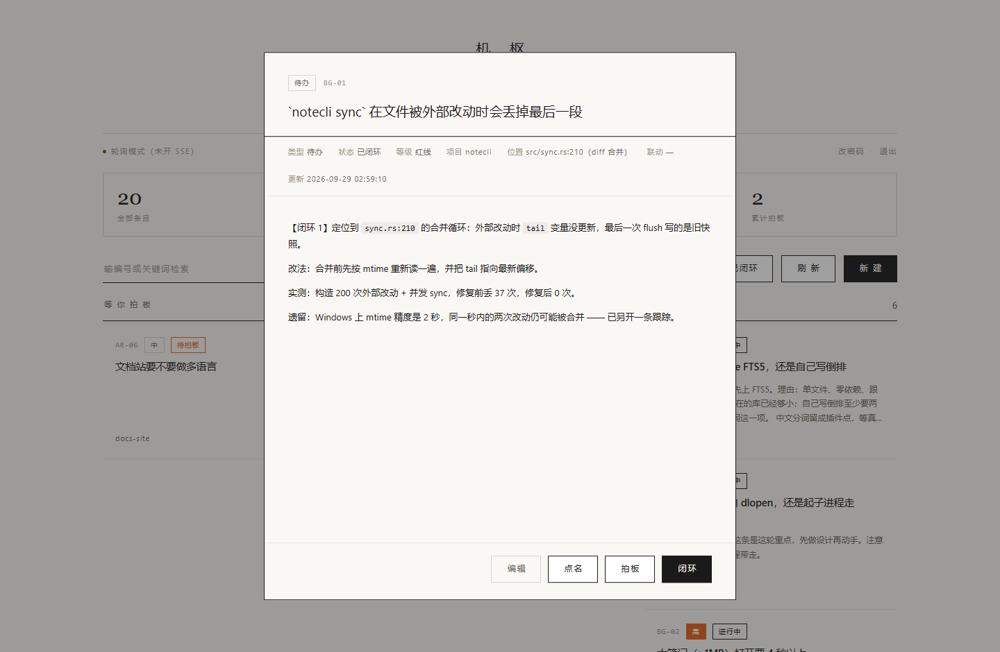
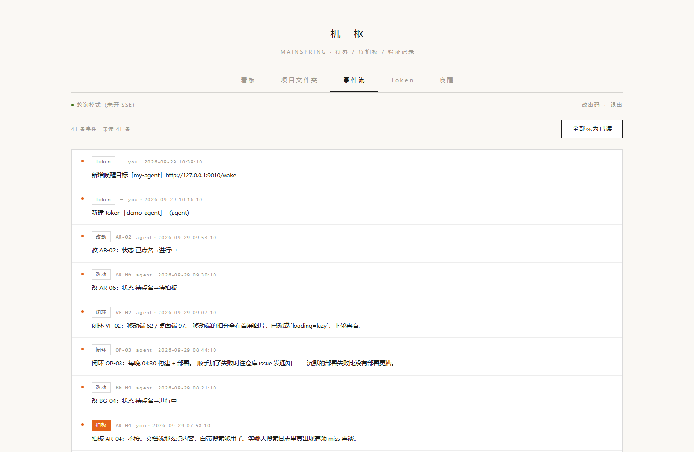
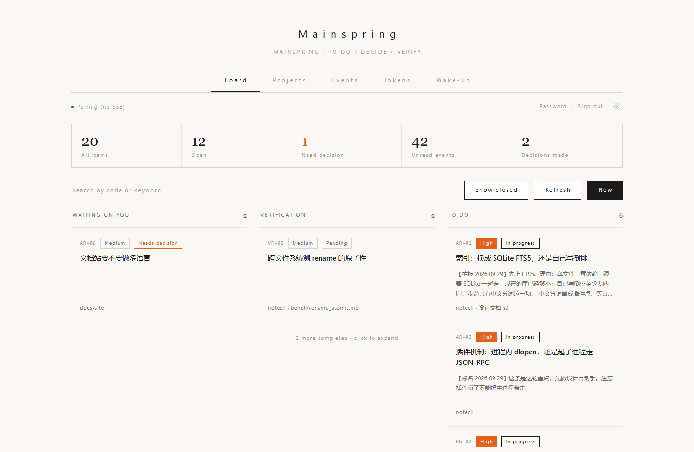
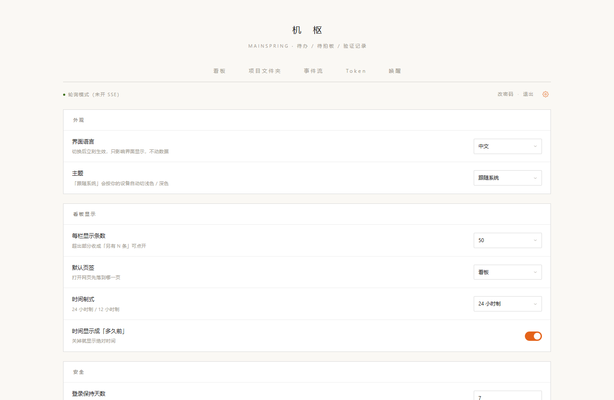

# Mainspring · 机枢

> An event log + decision board where AI agents pull work and humans sign off.
>
> **AI agent 干活，人来下判。**
> 一个「事件流 + 拍板看板」：agent 自己来拉活、自己回填状态；人只在一个地方做决定。

**为什么叫「机枢」** —— 机之枢，机械的枢纽：agent 在这一头干活，你在那一头拍板，
它俩之间的中转中心就是它。英文 `mainspring` 是钟表里那根带动整台机器的主发条 ——
两个名字说的是同一个零件：**让整台机器动起来的那个核心。**

**为什么需要它** —— agent 干活会漂移：它会自己扩大范围、自己宣布完成、自己认定
「这个应该没问题」。所以需要一个钉住它的点，让它在那里停下来等人拍板。

> 术语：项目名用「机枢 / Mainspring」，代码与接口里的动词仍是 `decide`（拍板）—— 同一个动作。

---

## 为什么不是又一个看板

这类东西已经不少了（[kanban-mcp](https://github.com/eyalzh/kanban-mcp)、[taskboard](https://github.com/tcarac/taskboard) 等），它们大多解决同一个问题：**给 agent 一张可读写的任务表**。

Mainspring 想解决再往前一步的那个问题：**agent 干完了，凭什么算完？**

所以这里的核心不是"任务列表"，是两件事：

**1. 未读事件流** —— 人和 agent 各有一条游标。agent 拉一次就知道"我不在的时候，人点名了什么、拍了什么板"；人打开页面就看到"agent 在我离线期间动了哪些"。
两个方向都**不需要额外沟通**，也不需要谁去同步上下文。

**2. 「拍板」是一等公民** —— 状态不是随便改的，它是一条链：

```
待点名  →  已点名  →  进行中  →  已闭环 / 已否决
   ↑          ↑          ↑            ↑
人点名    人指定了      agent 自己      agent 交结论
（排期）   谁来做        声明接手       人验收
```

关键约定：**「已闭环」= 收口，不等于「修好了」**。没真改的事，必须在结论里写明。这条约定比任何功能都重要 —— 它让"完成了"这句话重新变得可信。

一句话：**别人给你一张表，这里给你一条带签字的流水。**

---

## 它是什么

- 单进程 Python 服务，**零构建** —— 前端就是一个静态 HTML + 原生 JS，没有 npm / webpack / 编译步骤
- **SQLite 是唯一真值源**（不是"也支持 SQLite"，是只有它）
- 三条通道，互不干扰：

| 通道 | 路径 | 给谁 | 鉴权 |
|---|---|---|---|
| 网页 | `/`、`/api/*` | 人 | HMAC-SHA256 签名 Cookie（7 天），也认 token |
| AI | `/mcp` | MCP 客户端 | 多 token，查库鉴权，三级角色 |
| 探活 | `/health` | 监控 | 免鉴权 |

- 任何一个写操作，都在**同一个事务**里落一条事件 ⇒ 事件流天然就是审计日志
- 条目可以镜像成 `projects/<项目>/<编号>-<标题>.md`（**单向导出**，别反向改文件，会被覆盖）
- 前端支持**深链**：`/?tab=events` 直达页签、`/?open=AR-01` 打开就弹出那一条的详情
（方便把「某一条」直接发给别人）
- 内置一份**接入指南**，三个出口（MCP 工具 `ms_guide` / `GET /api/guide` / 网页「唤醒」页签），地址按你这次部署自动填 —— 它永远和你这一份实例一致，不会指向别人的地址
- **界面中英双语**：右上角齿轮 → 设置里切。连状态、等级这些**数据词**也跟着语言走
  （数据库里照旧存中文，只在显示层映射 —— 排序、筛选、MCP 接口一概不受影响）；
  深链 `?lang=en` 可以直接把英文界面发给别人
- **设置存在服务端**（`settings` 表，只落你改过的项）：语言、主题（跟随系统 / 浅色 / 深色）、
  每栏条数、默认页签、时间制式、登录保持天数、新 token 默认角色 —— 换台设备打开是同一份

---

## 长什么样



**详情弹窗** —— 每条都能展开看结论。截的是内置演示数据（虚构项目 notecli）：



**事件流** —— 人和 agent 各一条游标；任何写操作都在同一个事务里落一条事件，所以它天然就是审计日志：



**英文界面** —— 右上角齿轮里切成 English 就是全英文，连状态词一起（`?lang=en` 也行）：



**设置页** —— 外观（语言 / 主题）、看板显示、安全、关于，改完即时生效：



<sub>界面截图还有：项目文件夹镜像、Token 管理（明文只显示尾号）—— 都在 [`docs/`](docs/) 里。</sub>

## 快速开始

### 路线 A：只当本地看板用（不需要 agent）

```bash
git clone https://github.com/afd-ll/mainspring.git mainspring && cd mainspring
python3 -m venv venv
./venv/bin/pip install -r requirements.txt

cp .env.example .env       # 至少填 MS_USER / MS_PASS
./venv/bin/python ms_server.py
# 浏览器打开 http://127.0.0.1:8787
```

刚起起来是一张空板。**想第一眼就有东西看**（演示 / 试功能）：

```bash
./venv/bin/python tools/seed_demo.py     # 生成中性演示数据 → demo.sqlite3（绝不碰真库）
# 再让服务读它：.env 里填 MS_DB=/绝对路径/demo.sqlite3，然后照上面那条命令重启
```

`tools/seed_demo.py` 造的是虚构项目「notecli」的日常：20 条条目 / 41 条事件，
5 个编号前缀、4 种等级、6 种状态全齐 —— 打开就能看到这块板子本来长什么样。

### 路线 B：接上你自己的 agent

先照路线 A 起服务，然后在网页「Token」页签建一枚角色为 `agent` 的 token，交给你的 agent：

```jsonc
// 支持远程 MCP 的客户端（Claude Code / Cursor 等）
{
  "mcpServers": {
    "mainspring": {
      "url": "http://127.0.0.1:8787/mcp?token=<你的token>"
    }
  }
}
```

agent 接上之后的开工姿势：

```
ms_events(unread_only=True)                    # 我不在的时候，人做了什么
ms_get(code="AR-01")                           # 事件摘要不够，拿全文
ms_update(code="AR-01", status="进行中")        # 声明接手，人在页面上看得见
... 干活 ...
ms_close(code="AR-01", conclusion="做了什么 / 实测到什么 / 遗留什么")
ms_ack(up_to=<last_id>)                        # 收工标记，不然下次重复给你
```

不跑 MCP 也行 —— `GET /api/events?unread=1` 等一整套 REST 接口等价可用，任何语言都能接
（网页设置页读写的 `GET/POST /api/settings` 也在同一套里）。

---

## 核心概念

| 概念 | 说明 |
|---|---|
| **条目（item）** | 一条任务。主键是 `编号`，**只读**；各类前缀独立自增 |
| **编号前缀** | `AR` 架构 · `BG` Bug · `CX` 实验/探讨 · `OP` 运维流程 · `VF` 验证记录 |
| **事件（event）** | 任何写操作的同事务副产品：`add` / `update` / `close` / **`mention`（点名）** / **`decide`（拍板）** / `token` / `setting` |
| **未读** | 每条事件有 `ack_at`。agent 的游标存在 tokens 表 `last_pull_at` / `last_event_id` |
| **点名** | 人说"这条要做" ⇒ 状态转「已点名」+ 记事件 + 可选**主动唤醒** agent（HTTP POST 到它登记的钩子） |
| **拍板** | 人给决定 ⇒ 意见写进备注 + 类型转回「待办」+ 记事件 |
| **闭环** | 交结论收口。前缀 `【闭环 N】`，追加到备注尾部，不覆盖历史 |
| **token** | 多枚、可轮换、可吊销。角色 `readonly` / `agent` / `admin`。列表**永不返回明文**，单取一次即落审计事件 |

---

## 部署

systemd 单元样例在 [`tools/mainspring.service.example`](tools/mainspring.service.example)（装法写在文件头），环境变量全表见 [`.env.example`](.env.example)。

服务日志由 systemd 追加到 `http.log`，**systemd 自己不轮转** —— 不想让它一年涨到 100MB+ 就把 [`tools/logrotate.example`](tools/logrotate.example) 装到 `/etc/logrotate.d/`（装法与验证命令写在文件头）。

⚠️ **最常踩的一个坑**：`MS_PUBLIC_HOST` 同时决定 MCP 的 DNS-rebinding 白名单。只填 `127.0.0.1` 的话，外部 agent 连 `/mcp` 会拿到 `421 Invalid Host header` —— 它**不是**网络不通，别去查防火墙。

---

## 开发与自检

```bash
# 端到端探针：探活 / MCP 三种鉴权 / 工具 schema / 人类通道 / SQLite
./venv/bin/python tools/probe.py

# 唤醒链路集成测试（跑临时库，不碰真数据）
./venv/bin/python tests/test_wake.py

# 数据层单元测试（118 条断言，跑临时库 + 真库指纹隔离自证）
./venv/bin/python tests/test_db.py

# 每日备份（SQLite 在线备份 API + integrity_check）
bash tools/backup.sh

# 发布前隐私自检（IP / 邮箱 / 家目录 / Windows 路径 / 手机号；图片字体等二进制自动跳过，不然按文本读会读出满屏假阳性；自己的词表用 --words 传，别写进仓库）
./venv/bin/python tools/privacy_scan.py

# 文档一致性自检（文档里提到的路径是否真的在、测试是否都写进了文档 —— 防的是「三份文档各说各话」）
./venv/bin/python tools/doc_check.py
```

## 参与

见 [CONTRIBUTING.md](CONTRIBUTING.md)。**这个项目最需要的不是更多功能，是更多用法** —— 你把它接到哪个 agent 上、卡在哪一步，都是有用的信息。

## 路线图

诚实列，不装没有：

- [ ] 多用户 / OAuth —— 现在是一套口令 + 多 token，适合单人自托管
- [ ] 主题配置化（现在是一套配色写死在前端）

## License

[Apache-2.0](LICENSE) —— 带专利授权，企业里也能用。
